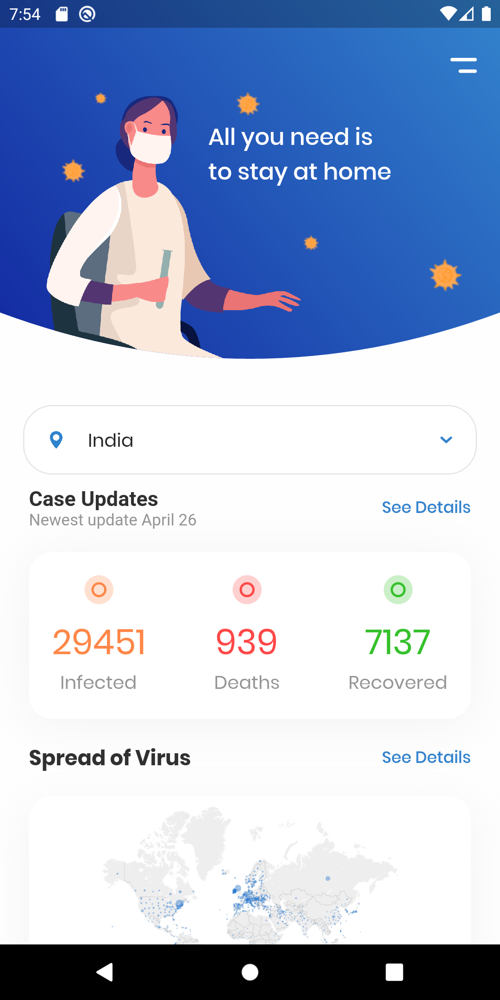

# covid19_tracker

A very simple app to track Covid-19 stats in India. Right now it only gives the total number of infections, deaths and recoveries in India, however I will add numbers for every state. 

  

## Building the app

*You will require flutter and the Android SDK to follow along.*

For the complete set up to start working with flutter please visit here:
[https://flutter.dev/docs/get-started/install](https://flutter.dev/docs/get-started/install)

Choose your operating system and proceed accordingly.
 

  

**Step 1:**

  

Download or clone this repo by using the link below:

  

```

https://github.com/knightvertrag/Covid19-tracker.git

```

  

**Step 2:**

  

Go to project root and execute the following command in console to get the required dependencies:

  

```

flutter pub get

```

  

**Step 3:**

  

Connect your physical device(with debugger options turned on)  or emulator to your IDE.

  

**Step 4:**

  

Start the debug build by running the main.dart file
